# 🪶 Nosce-Codicem: 네 코드를 알라
*A CLI-based visualization tool for understanding your Python logic.*

---
### 🧩 Project Overview
알고리즘 문제를 풀다보면 반복문이나 재귀문 내부에서 변수나 리스트의 값 변화를 직접 추적하고 싶을 때가 많습니다.  
그럴 때마다 테스트 코드를 작성하고, 지저분한 출력을 통해 오류를 찾는 과정이 번거롭다고 느꼈습니다.  

이에 착안하여,
1) **코드 한 줄만 실행해도 변수의 변화를 자동으로 추적**하고 
2) **별도의 창을 통해 이해하기 쉽게 출력**해주는  

툴을 만들어보자는 취지에서 해당 프로젝트를 기획했습니다.  

Nosce-Codicem 툴은 (개인적으로 가장 오류를 확인하기 어려운 구문인) **반복문과 재귀문**에서 **변수와 리스트**의 상태를 추적하고,  
별도의 CLI 창을 통해 알고리즘 진행 단계에 따라 추적한 값을 출력합니다.

---
### 🚀 Project Goal

- **CLI 기반의 알고리즘 학습 보조 도구**를 개발하여,  
  학습자가 자신의 코드 흐름과 변수 변화를 직관적으로 이해할 수 있도록 돕습니다.  
- 최종적으로 **PyPI에 배포 가능한 오픈소스 파이썬 라이브러리**로 완성하는 것을 목표로 합니다.

---
### ✨ 주요 기능  

- sys.settrace 기반 변수와 이벤트 추적
- Table을 통한 Loop문 시각화
    - 다수의 변수와 리스트들도 table로 표현 가능
- 재귀호출 tree와 timeline을 통한 Recursive문 시각화
    - 함수 호출 시 tree와 timeline 동시 출력
- Rich 기반 CLI 출력


---
### ⚙️ 프로젝트 구조
```
NOSCE-CODICEM/
├─ src/
│  └─ nosce_codicem/
│     ├─ api/           # 사용자 API 구성
│     ├─ core/          # sys.settrace 컨트롤러, 이벤트 디스패처, 전체 실행 흐름 관리 로직
│     ├─ handlers/      # 이벤트를 해석하고, 전달하는 객체 정의
│     ├─ observers/     # 변수와 리스트를 관찰하고 기록하는 객체 정의
│     ├─ output/        # 이벤트 구조화, CLI 시각화
│     └─ __init__.py    # 패키지 초기화
│
├─ tests/               # 테스트 코드 모음
├─ LICENSE              # MIT 라이선스
└─ README.md
```

---
### 🧐 How to Use

1) `pip install nosce-codicem`으로 패키지를 설치합니다.

2) `from nosce_codicem import trace` 형태로 trace 빌더를 불러옵니다.

3) 반복문 안의 변수를 추적하려면 `trace.variable(...).loop(start, end)`를 사용합니다.  
   - `variable()`에는 추적할 변수명을 문자열로 입력합니다.  
     여러 변수를 추적하고 싶다면 쉼표로 구분해 나열할 수 있습니다.  
   - `loop(start, end)`에는 반복문의 **시작 라인 번호와 종료 라인 번호**를 입력합니다.

4) 반복문 안의 리스트를 추적하려면 `trace.list(...).loop(start, end)`를 사용합니다.  
   - `list()`에는 추적할 리스트명을 문자열로 입력합니다.  
     여러 리스트를 추적할 경우 역시 쉼표로 구분해 나열합니다.

5) 재귀문 안의 변수를 추적하려면 `trace.variable(...).recursion(func_name)`을 사용합니다.  
   - `variable()`의 사용 방식은 반복문과 동일합니다.  
   - `recursion(func_name)`에는 추적하고자 하는 재귀 함수명을 문자열로 입력합니다.

6) 재귀문 안의 리스트를 추적하려면 `trace.list(...).recursion(func_name)`을 사용합니다.  
   - 리스트 사용 방식 역시 반복문의 경우와 동일합니다.


**⚠️주의사항⚠️**  
trace는 반드시 **관찰하고자 하는 코드가 실행되기 전에** 호출해야 정상적으로 동작합니다.  
Python의 `sys.settrace`는 main 스크립트와 동일한 타이밍에서 트리거되기 때문에,  
trace가 실제로 감시할 수 있는 것은 **호출 시점 이후에 새로 실행되는 함수와 그 내부의 흐름뿐**입니다.  
따라서 이미 실행이 시작된 전역 코드나, 함수 호출이 끝난 뒤에 trace를 선언하면 어떤 이벤트도 포착할 수 없습니다.  
이러한 이유로, 관찰 대상 로직은 반드시 **함수 형태로 선언**하고,  
그 함수를 호출하기 전에 trace를 활성화하는 해야만 합니다.

---
### 🧑‍🏫 사용 예시

> ✔ 루프 + 변수 예시
```
from nosce_codicem import trace

def count_up():
    total = 0
    for i in range(5):    # line number : 5
        total += i        # line number : 6

trace.variable("i", "total").loop(5, 6)
count_up()
```
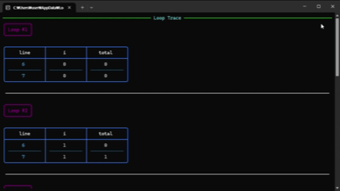
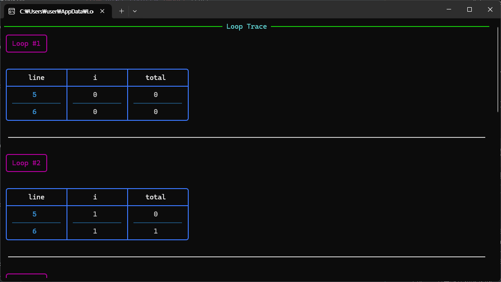
(중간 출력 생략)  
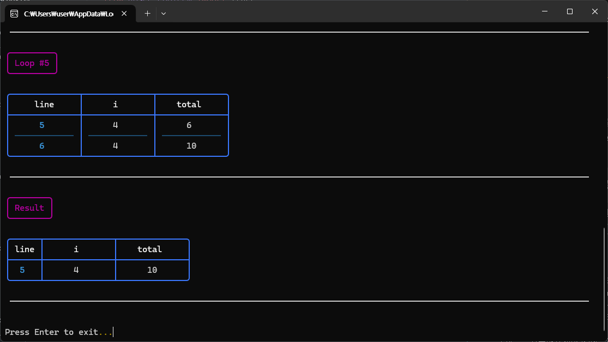
  
> ✔ 루프 + 리스트 예시  
```
from nosce_codicem import trace

def test_list_loop():
    arr = [1, 2, 3, 4, 5]
    i = 0
    while i < len(arr):        # line number : 6
        arr[i] = arr[i] * 2
        i += 1                 # line number : 8

trace.list("arr").loop(6, 8)
test_list_loop()
```
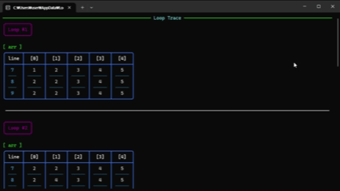
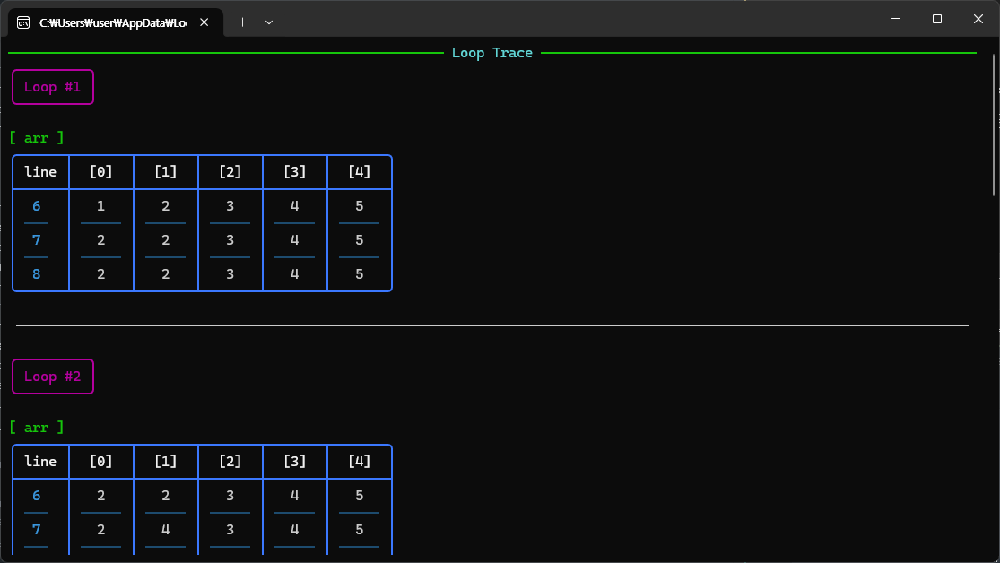
(중간 출력 생략)  
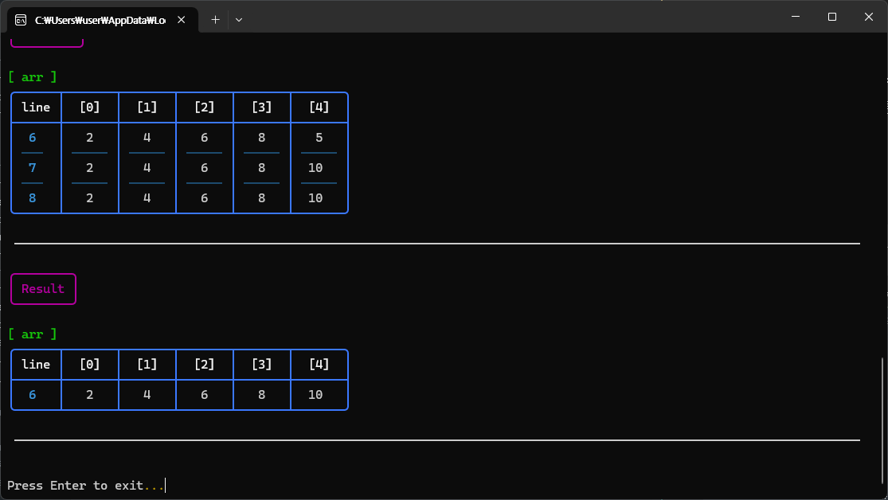

> ✔ 재귀 + 변수 예시
```
from nosce_codicem import trace

def fib(n):
    if n <= 1:
        return n
    
    a = fib(n - 1)   # 변수 a 추적
    b = fib(n - 2)   # 변수 b 추적
    result = a + b   # result도 추적
    return result

trace.variable("n", "a", "b", "result").recursion("fib")
fib(5)
```
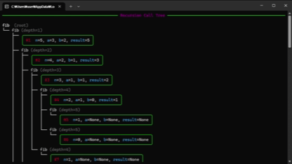
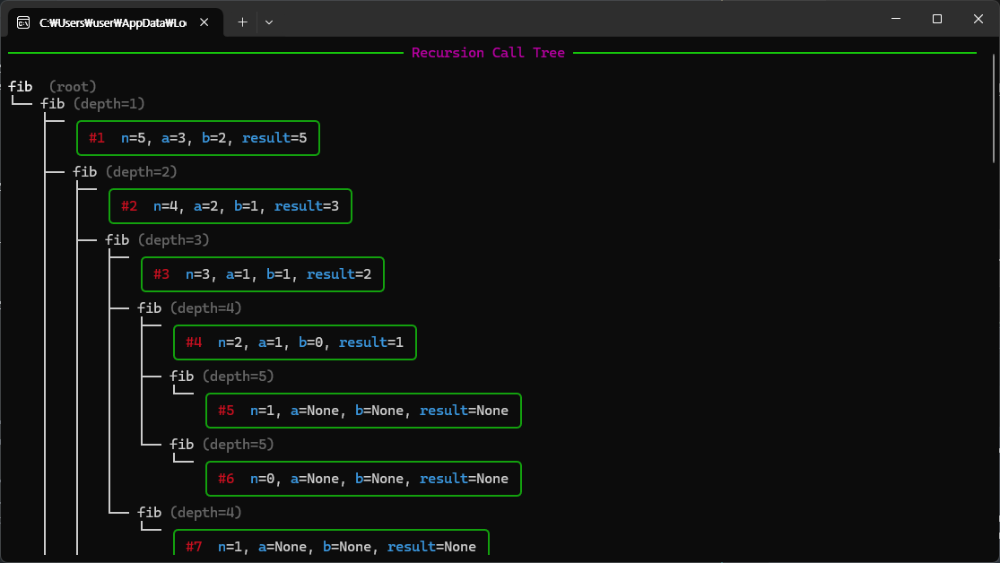 
(나머지 트리 생략)  
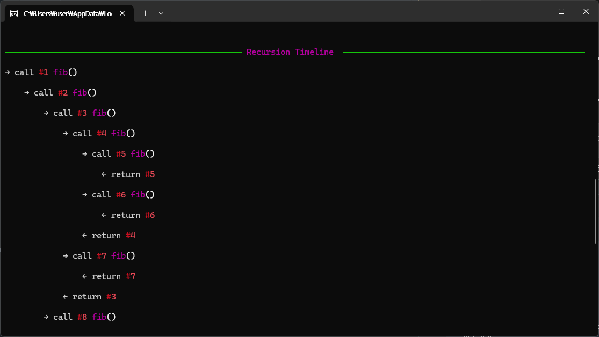
(나머지 타임라인 생략)  

> ✔ 재귀 + 리스트 예시
```
from nosce_codicem import trace

def merge_sort(arr):
    if len(arr) <= 1:
        return arr

    mid = len(arr) // 2
    left = merge_sort(arr[:mid])
    right = merge_sort(arr[mid:])

    merged = []
    i = j = 0

    while i < len(left) and j < len(right):
        if left[i] <= right[j]:
            merged.append(left[i])
            i += 1
        else:
            merged.append(right[j])
            j += 1

    merged.extend(left[i:])
    merged.extend(right[j:])
    return merged

trace.list("arr").recursion("merge_sort")
arr = [7, 5, 2, 4, 1, 3, 6]
merge_sort(arr)
```  
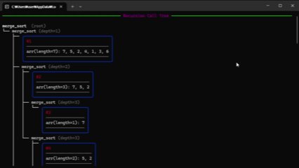
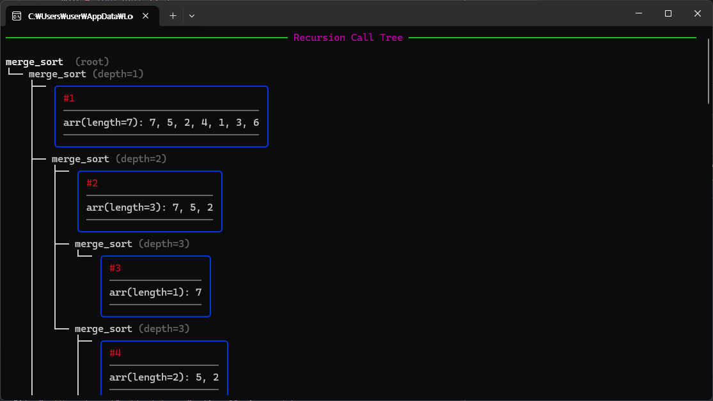
(나머지 트리 생략)  
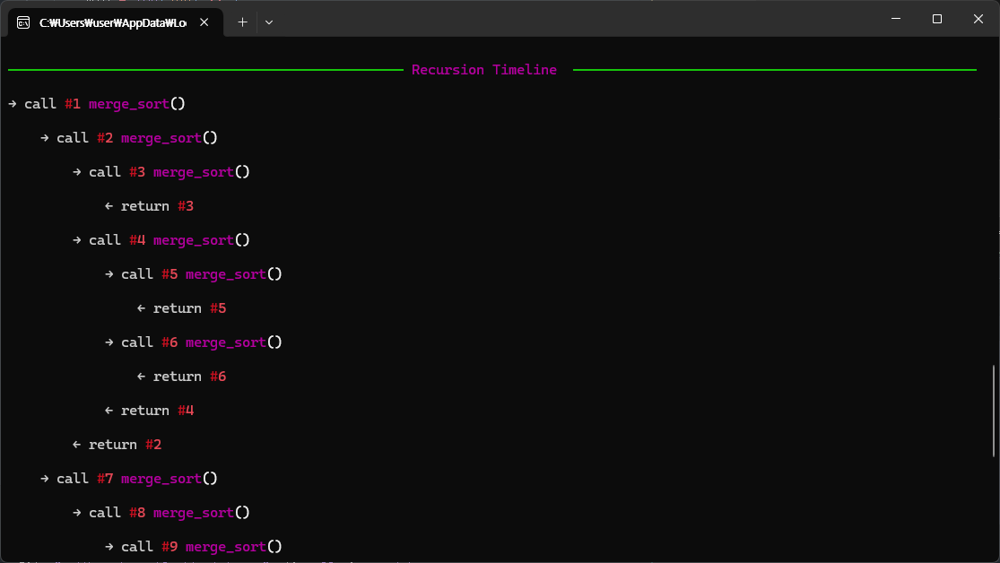
(나머지 타임라인 생략)

---
### 🚧 Limitations
- "CLI 창을 통한 시각화"라는 주제의 한계에 의해  
추적하는 변수의 양이 너무 많거나, 리스트의 길이가 길거나, 재귀의 깊이가 너무 깊으면  
시인성이 보장되지 않습니다.

- 해당 프로젝트의 리스트 추적에는 안정적인 로직을 위해 deepcopy가 사용되어  
길고 복잡한 작업 시 프로그램의 성능을 급격히 떨어뜨릴 수 있습니다.  
간단한 알고리즘 풀이에만 적합합니다.


---
### 🛠️ 설치 환경

- **Python 3.9 ~ 3.13**
  - Windows Store Python은 `sys.settrace` 동작 방식 문제로 인해 정상적으로 작동하지 않을 수 있습니다.

- Windows/Mac/Linux 지원
  - 핵심 로직은 Windows 외의 OS에서도 작동할 수 있도록 구현했지만,  
  Windows 외의 환경에서 테스트를 해보지 못했기에 타 OS에서의 동작을 장담하지 못합니다.

- Rich 13.0 이상 권장
  - CLI 시각화는 파이썬의 외부 라이브러리 Rich를 기반으로 하며, 13.0 이상 버전을 권장합니다.  

- VS Code
  - 해당 프로젝트는 VS Code IDE를 통해 작성, 테스트되었기 때문에,  
  타 IDE에서는 따라 일부 기능이 다르게 동작할 수 있습니다.

---
### ⚖️ License
이 프로젝트는 **MIT License** 하에 배포됩니다.  
사용자는 라이선스 조건 내에서 자유롭게 소스코드를 수정·재배포할 수 있습니다.

보다 자세한 내용은 저장소의 `LICENSE` 파일을 참고하십시오.

---
### 🔎 Open Source & Reference

- **Rich (MIT License)** 
  - 파이썬의 외부 라이브러리
  - CLI 출력 스타일링 및 테이블·트리 렌더링에 사용  


- **Python Standard Library (PSF License)**  
  - `sys.settrace` : 실행 흐름 추적  
  - `subprocess` : viewer 독립 콘솔 실행  